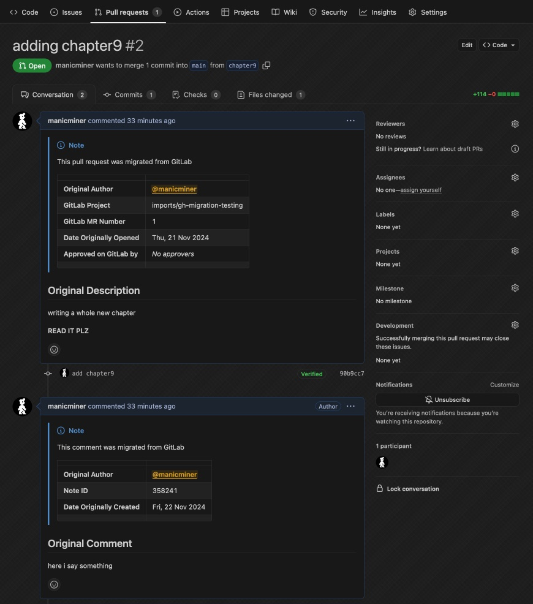
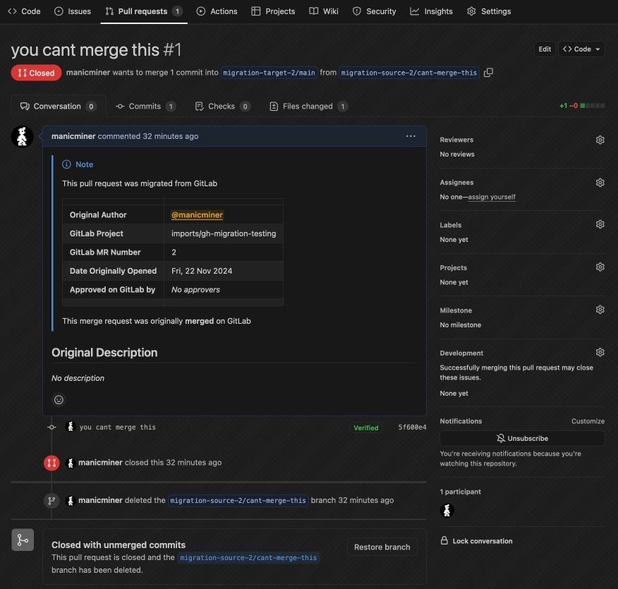

# GitLab to GitHub Repository Migration Tool

This tool can migrate projects from GitLab to repositories on GitHub. It currently supports:

* migrating the git repository with full history
* migrating merge requests and translating them into pull requests, including closed/merged ones
* renaming the `master` branch to `main` along the way

It does not support migrating issues, wikis or any other primitive at this time. PRs welcome!

Both gitlab.com and GitLab self-hosted are supported, as well as github.com and GitHub Enterprise.

## Installing

```
go install github.com/manicminer/gitlab-migrator
```

Golang 1.23 was used, you may have luck with earlier releases.

## Usage

_Example Usage_

```
gitlab-migrator -github-user=mytokenuser -gitlab-project=mygitlabuser/myproject -github-repo=mygithubuser/myrepo -migrate-pull-requests
```

Written in Go, this is a cross-platform CLI utility that accepts the following runtime arguments:

```
  -delete-existing-repos
    	whether existing repositories should be deleted before migrating (defaults to: false)
  -github-domain string
    	specifies the GitHub domain to use (default "github.com")
  -github-repo string
    	the GitHub repository to migrate to
  -github-user string
    	specifies the GitHub user to use, who will author any migrated PRs (required)
  -gitlab-domain string
    	specifies the GitLab domain to use (default "gitlab.com")
  -gitlab-project string
    	the GitLab project to migrate
  -max-concurrency int
    	how many projects to migrate in parallel (default 4)
  -migrate-pull-requests
    	whether pull requests should be migrated (defaults to: false)
  -projects-csv string
    	specifies the path to a CSV file describing projects to migrate (incompatible with -gitlab-project and -github-project)
  -rename-master-to-main
    	rename master branch to main and update pull requests (defaults to: false)
```

Use the `-github-user` argument to specify the GitHub username for whom the authentication token was issued (mandatory).

You can specify an individual GitLab project with the `-gitlab-project` argument, along with the target GitHub repository with the `-github-repo` argument.

Alternatively, you can supply the path to a CSV file with the `-projects-csv` argument, which should contain two columns:

```csv
gitlab-group/gitlab-project-name,github-org-or-user/github-repo-name
```

For authentication, the `GITLAB_TOKEN` and `GITHUB_TOKEN` environment variables must be populated. You cannot specify tokens as command-line arguments.

To enable migration of GitLab merge requests to GitHub pull requests (including closed/merged ones!), specify `-migrate-pull-requests`.

To delete existing GitHub repos prior to migrating, pass the `-delete-existing-repos` argument. _This is potentially dangerous, you won't be asked for confirmation._

Note: If the destination repository does not exist, this tool will attempt to create a private repository. If the destination repo already exists, it will be used unless you specify `-delete-existing-repos`

Specify the location of a self-hosted instance of GitLab with the `-gitlab-domain` argument, or a GitHub Enterprise instance with the `-github-domain` argument.

As a bonus, this tool can transparently rename the `master` branch on your GitLab repository, to `main` on the migrated GitHub repository - enable with the `-rename-master-to-main` argument.

By default, 4 workers will be spawned to migrate up to 4 projects in parallel. You can increase or decrease this with the `-max-concurrency` argument. Note that due to GitHub API rate-limiting, you may not experience any significant speed-up. See [GitHub API docs](https://docs.github.com/en/rest/using-the-rest-api/rate-limits-for-the-rest-api) for details.

## Logging

This tool is entirely noninteractive and outputs different levels of logs depending on your interest. You can set the `LOG_LEVEL` environment to one of `ERROR`, `WARN`, `INFO`, `DEBUG` or `TRACE` to get more or less verbosity. The default is `INFO`.

## Idempotence

This tool tries to be idempotent. You can run it over and over and it will patch the GitHub repository, along with its pull requests, to match what you have in GitLab. This should help you migrate a number of projects without enacting a large maintenance window.

_Note that this tool performs a forced mirror push, so it's not recommended to run this tool after commencing work in the target repository._

For pull requests and their comments, the corresponding IDs from GitLab are added to the Markdown header, this is parsed to enable idempotence (see next section).

## Pull Requests

Whilst the git repository will be migrated verbatim, the pull requests are managed using the GitHub API and typically will be authored by the person supplying the authentication token.

Each pull request, along with every comment, will be prepended with a Markdown table showing the original author and some other metadata that is useful to know.  This is also used to map pull requests and their comments to their counterparts in GitLab and enables the tool to be idempotent.

As a bonus, if your GitLab users add the URL to their GitHub profile in the `Website` field of their GitLab profile, this tool will add a link to their GitHub profile in the markdown header of any PR or comment they originally authored.

This tool also migrates merged/closed merge requests from your GitLab projects. It does this by reconstructing temporary branches in each repo, pushing them to GitHub, creating then closing the pull request, and lastly deleting the temporary branches. Once the tool has completed, you should not have any of these temporary branches in your repo - although GitHub will not garbage collect them immediately such that you can click the `Restore branch` button in any of these PRs.

_Example migrated pull request (open)_



_Example migrated pull request (closed)_



## Contributing, reporting bugs etc...

Please use GitHub issues & pull requests. This project is licensed under the MIT license.
